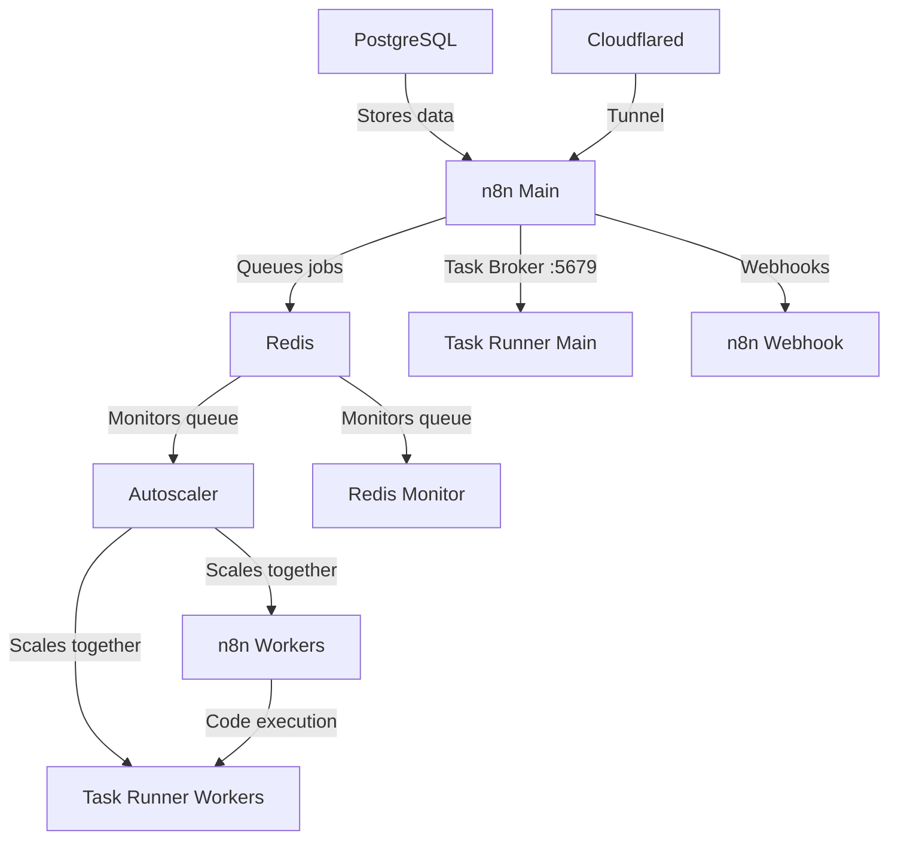

# n8n Autoscaling System (n8n 2.0 Ready)

A Docker-based autoscaling solution for n8n workflow automation platform. Dynamically scales worker containers based on Redis queue length. No need to deal with k8s or any other container scaling provider - a simple script runs it all and is easily configurable.

**Now updated for n8n 2.0** with external task runners support.

Tested with hundreds of simultaneous executions running on an 8 core 16gb ram VPS.

Includes Puppeteer and Chromium built-in for pro level scraping from the n8n code node, works better than the community nodes.

Simple install, just clone the files + docker compose up

## What's New in n8n 2.0

n8n 2.0 introduced breaking changes for task runners:
- Task runners are now **separate containers** (external mode)
- Each worker needs its own task runner sidecar
- The main n8n instance exposes a task broker on port 5679
- External packages must be configured in the task runner image

This build handles all of this automatically - the autoscaler scales both workers and their task runners together.

## Architecture Overview



### Services

| Service | Description |
|---------|-------------|
| `n8n` | Main n8n instance (editor, API) |
| `n8n-task-runner` | Task runner for main instance |
| `n8n-webhook` | Dedicated webhook processor |
| `n8n-worker` | Queue workers (autoscaled) |
| `n8n-worker-runner` | Task runners for workers (autoscaled 1:1 with workers) |
| `redis` | Job queue |
| `postgres` | Database (with pgvector) |
| `n8n-autoscaler` | Monitors queue and scales workers + runners |
| `redis-monitor` | Queue monitoring |
| `cloudflared` | Cloudflare tunnel |

## Features

- Dynamic scaling of n8n worker containers based on queue length
- **n8n 2.0 compatible** - external task runners with proper sidecar scaling
- Configurable scaling thresholds and limits
- Redis queue monitoring
- Docker Compose based deployment
- Health checks for all services
- Puppeteer/Chromium for web scraping in Code nodes
- External npm packages (ajv, puppeteer-core, etc.)

## Prerequisites

- Docker and Docker Compose
- If you are a new user, I recommend either Docker Desktop or using the docker convenience script for Ubuntu
- Set up your Cloudflare domain and subdomains

## Quick Start

1. Clone this repository:
   ```bash
   git clone https://github.com/conor-is-my-name/n8n-autoscaling.git
   cd n8n-autoscaling
   ```

2. Copy the example environment file:
   ```bash
   cp .env.example .env
   ```

3. Configure your environment variables in `.env`:
   - Set strong passwords for `POSTGRES_PASSWORD`, `N8N_ENCRYPTION_KEY`, `N8N_RUNNERS_AUTH_TOKEN`
   - Update domain settings (`N8N_HOST`, `N8N_WEBHOOK`, etc.)
   - Add your `CLOUDFLARE_TUNNEL_TOKEN`
   - Optionally set `TAILSCALE_IP` for private access

4. Create the external network:
   ```bash
   docker network create shark
   ```

5. Start everything:
   ```bash
   docker compose up -d --build
   ```

## Configuration

### Key Environment Variables

| Variable | Description | Default |
|----------|-------------|---------|
| `MIN_REPLICAS` | Minimum number of worker containers | 1 |
| `MAX_REPLICAS` | Maximum number of worker containers | 5 |
| `SCALE_UP_QUEUE_THRESHOLD` | Queue length to trigger scale up | 5 |
| `SCALE_DOWN_QUEUE_THRESHOLD` | Queue length to trigger scale down | 1 |
| `POLLING_INTERVAL_SECONDS` | How often to check queue length | 10 |
| `COOLDOWN_PERIOD_SECONDS` | Time between scaling actions | 10 |

### Task Runner Configuration (n8n 2.0)

| Variable | Description | Default |
|----------|-------------|---------|
| `N8N_RUNNERS_ENABLED` | Enable external task runners | true |
| `N8N_RUNNERS_MODE` | Task runner mode | external |
| `N8N_RUNNERS_AUTH_TOKEN` | Auth token for runners | (set your own) |
| `N8N_RUNNERS_MAX_CONCURRENCY` | Max concurrent tasks per runner | 5 |
| `NODE_FUNCTION_ALLOW_EXTERNAL` | Allowed npm packages in Code nodes | ajv,puppeteer-core,... |

### Timeout Configuration

Adjust these to be greater than your longest expected workflow execution time (in seconds):
```
N8N_QUEUE_BULL_GRACEFULSHUTDOWNTIMEOUT=300
N8N_GRACEFUL_SHUTDOWN_TIMEOUT=300
```

## Scaling Behavior

The autoscaler:
1. Monitors Redis queue length every `POLLING_INTERVAL_SECONDS`
2. Scales up when:
   - Queue length > `SCALE_UP_QUEUE_THRESHOLD`
   - Current replicas < `MAX_REPLICAS`
3. Scales down when:
   - Queue length < `SCALE_DOWN_QUEUE_THRESHOLD`
   - Current replicas > `MIN_REPLICAS`
4. Respects cooldown period between scaling actions
5. **Scales workers and task runners together** (1:1 ratio)

## Adding External Packages

To add npm packages for use in Code nodes:

1. Edit `Dockerfile.runner` and add packages to the pnpm install:
   ```dockerfile
   RUN /usr/local/bin/node /usr/local/lib/node_modules/corepack/dist/corepack.js pnpm add \
       ajv \
       ajv-formats \
       puppeteer-core@22.15.0 \
       your-package-here
   ```

2. Edit `n8n-task-runners.json` and add your package to the allowlist:
   ```json
   "NODE_FUNCTION_ALLOW_EXTERNAL": "moment,ajv,ajv-formats,puppeteer-core,puppeteer,your-package-here"
   ```

3. Rebuild:
   ```bash
   docker compose build --no-cache n8n-task-runner n8n-worker-runner
   docker compose up -d
   ```

## Monitoring

The system includes:
- Redis queue monitor service (`redis-monitor`)
- Docker health checks for all services
- Detailed logging from autoscaler

View logs:
```bash
# All services
docker compose logs -f

# Specific service
docker compose logs -f n8n-autoscaler

# Task runners
docker compose logs -f n8n-task-runner n8n-worker-runner
```

## Updating

To update:
```bash
docker compose down
docker compose build --no-cache
docker compose up -d
```

## Troubleshooting

### Check container status
```bash
docker compose ps
```

### Check logs
```bash
docker compose logs [service]
```

### Verify Redis connection
```bash
docker compose exec redis redis-cli ping
```

### Check queue length
```bash
docker compose exec redis redis-cli LLEN bull:jobs:wait
```

### Task runner issues
If Code nodes fail, check task runner logs:
```bash
docker compose logs n8n-task-runner
```

Verify the task broker is accessible:
```bash
docker compose exec n8n-task-runner wget -qO- http://n8n:5679/health || echo "Not reachable"
```

### Webhook URL format
Webhooks use your Cloudflare subdomain:
```
https://webhook.yourdomain.com/webhook/your-webhook-id
```

## File Structure

```
.
├── docker-compose.yml        # Main compose file
├── Dockerfile                # Main n8n image (based on n8nio/n8n)
├── Dockerfile.runner         # Task runner image (based on n8nio/runners)
├── n8n-task-runners.json     # Task runner launcher config (security settings, allowed packages)
├── .env.example              # Example environment configuration
├── .env                      # Your configuration (git-ignored)
├── autoscaler/
│   ├── Dockerfile            # Autoscaler container
│   └── autoscaler.py         # Scaling logic
└── monitor/
    └── monitor.Dockerfile    # Redis monitor container
```

## Task Runner Security Configuration

The `n8n-task-runners.json` file controls security settings for the JavaScript task runner:

| Setting | Description |
|---------|-------------|
| `NODE_ENV=test` | Disables prototype freezing (required for puppeteer) |
| `NODE_FUNCTION_ALLOW_EXTERNAL` | Comma-separated list of allowed npm packages |
| `NODE_FUNCTION_ALLOW_BUILTIN` | Allowed Node.js built-in modules |
| `PUPPETEER_EXECUTABLE_PATH` | Path to chromium binary |

**Note:** The default config removes sandbox restrictions to allow puppeteer and libraries like AJV that use `new Function()`. If you don't need these, you can restore the original security settings from the n8nio/runners image.

## License

MIT License - See [LICENSE](LICENSE) for details.

## Credits

For step by step instructions follow this guide: https://www.reddit.com/r/n8n/comments/1l9mi6k/major_update_to_n8nautoscaling_build_step_by_step/

Now includes Cloudflared. Configure on cloudflare.com and paste your token in the .env file.
